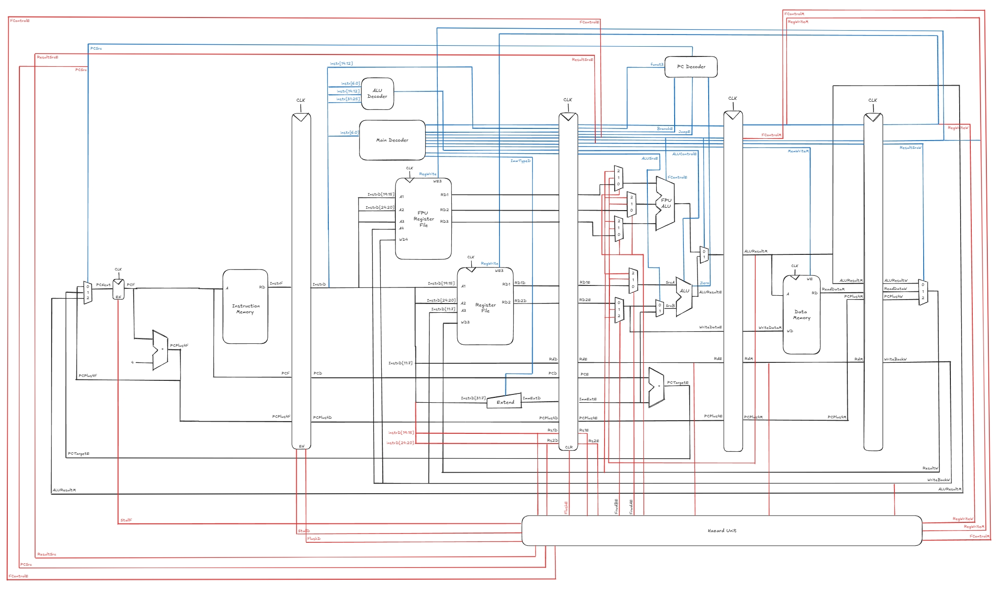

# Pipelined RISC-V Processor

A 5-stage pipelined processor implemented in SystemVerilog, capable of executing RV32I programs. The processor consists of three main components: a datapath (divided into fetch, decode, execute, memory, and writeback stages), a control unit, and a hazard unit (capable of forwarding, stalling, and control logic).

## Datapath Diagram


## Instruction Set
There are 17 unique instructions that the processor can execute. This combination of instructions forms a turing complete instruction set.

|  Type  |              Instructions             |
|--------|---------------------------------------|
| R-type | ADD, SUB, AND, OR, XOR, SLT           |
| I-type | ADDI, XORI, ORI, ANDI, SLTI, LW, JALR |
| S-type | SW                                    |
| B-type | BEQ, BNE                              |
| J-type | JAL                                   |

## Installation

### 1. Recommended Applications
- Quartus Prime Lite (with Questa)
- Visual Studio Code 

### 2. Clone the Repository
```bash
git clone https://github.com/tebsjejsn/risc-v-processor-single-sv.git
cd risc-v-processor-single-sv
```

## Running the Project

### 1. Program Setup
- Open the repository in Visual Studio Code to browse and edit source files.
- Launch Questa and find the transcript window

### 2. Compilation
```
vlib work
vlog src/*.sv tb/*.sv
```

### 3. Load the Testbench
```
vsim work.tb
```

### 4. Run the Simulation
- Go to the sim window, right-click module named "tb", and select Add > To Wave > All items in region
- Type run -all in the Questa transcript window

### 5. Verify Output
- A passing simulation will print the following to the transcript: SUCCESS: "" instructions executed flawlessly!

### 6. (Optional) Add Unique Instructions
- To run a new set of instructions, change instructions.txt to the set of new instructions and riscvtest.txt to the expected PC and ResultW values (as seen in the diagram)
- Follow steps 1-5 again

## License
Distributed under the MIT License. See `LICENSE` for more information.